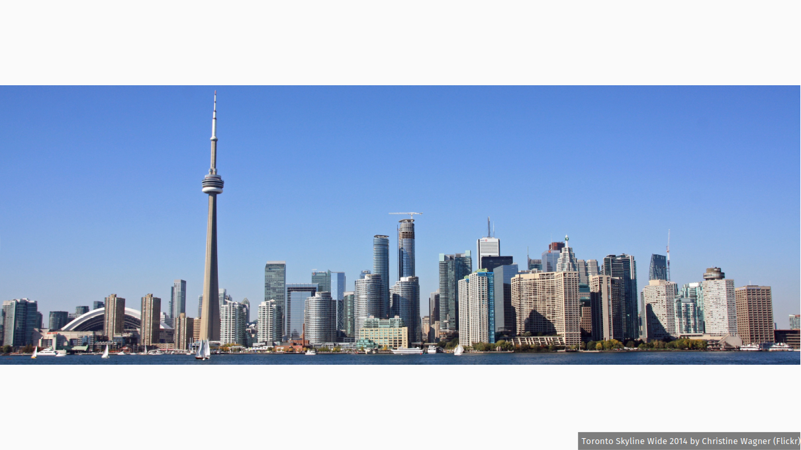

# Fullframegraphics for Pandoc and Quarto

This Pandoc filter / Quarto extension allows to easily create and configure Beamer slides with full frame graphics.

It has at least four advantages over using plain LaTeX code in your markdown documents:

1.  It computes how to fill the frame, whether your image is too large or too tall.
2.  It displays nicely in WYSIWYM markdown editors such as RStudio or Zettlr: you still have the image preview, and you can give titles to your slides to spot them easily in the outline.
3.  It is easily configurable, even partly on a case by case basis.

The LaTeX part of the code is blattantly ispired by [Ojdo’s work](https://www.ojdo.de/wp/2018/06/finally-the-definitive-full-frame-graphic-commands-for-beamer-in-latex/).

## Installing

### With Quarto

``` bash
quarto add pagiraud/fullframegraphics
```

This will install the extension under the `_extensions` subdirectory.

### With Pandoc

Simply copy the `fullframegraphics.lua` file where you need it (see [Pandoc manual](https://pandoc.org/MANUAL.html#option--filter)).

Pandoc \>= 3.1.13 is required.

## Using

### With Quarto

Indicate in the YAML header that you want to use this filter:

``` yaml
filters:
  - fullframegraphics
```

### With Pandoc

Pass the filter to Pandoc with the `lua-filter` or `-L` command line option.

``` cli
pandoc --lua-filter fullframegraphics.lua
```

### Common usage

#### Basic usage

In your Markdown (or Quarto Markdown) document, simply add the fullframegraphic class to the header corresponding to your slide-level (2 by default):

``` markdown
## Title of the full frame slide {.fullframegraphic}

![Some optionnal caption]{my/image.jpg}
```

Please note that this title won’t be displayed in the resulting PDF: the filter will delete it. It is just there to make your Markdown document more readable while writing.

By default, the image fills all the slide: if their ratios are not the same, the image will be "cropped" (actually it just lets it go out of the frame). This is more pleasant as not white stripes are displayed. But you may need to show all you image. This can be done on a case by case basis by adding the noadjust class to your image:

``` markdown
## Title of the full frame slide {.fullframegraphic}

{.noadjust}
```

#### Options

Options can be configured in the YAML header. Here are all the options available with their default values:

``` yaml
fullframegraphics:
  adjustimage: true
  adjustimageclass: "adjust"
  noadjustimageclass: "noadjust"
  captionposition: "south east"
  anchorposition: "south east"
  fontsize: "tiny"
  textcolor: "white"
  fillcolor: "black"
  fillopacity: ".5"
  textopacity: "1"
  innersep: "2pt"
  textheight: "1ex"
  textdepth: ".25ex"
```

If set to `false`, the `adjustimage` option reverses the default behavior: images won’t be cropped and you’ll need to add `{.adjust}` (actually, any other class than noadjust) after your image so that it fills the slide.

`adjustimageclass` and `noadjustimageclass` are the names of the classes for adjusting or not the images on a case by case basis. There is no point changing them unless they conflict with some other of your classes that may have the same name.

All the other options are there to configure the caption appearance. These default are the same than Ojdo’s. They are used to fill the `\tikzset`command, that uses [pgfkeys](https://tikz.dev/pgfkeys#pgf.pgfkeys).

## Example

Here is the source code for a minimal example for Quarto: [example.qmd](example.qmd). And another one for Pandoc: [example.md](example.md). The resulting PDF is there: [example.pdf](example.pdf).

Except for the YAML header, the code is the same:

``` markdown
## A too wide image {.fullframegraphic}


## A too wide image (no adjust) {.fullframegraphic}

{.noadjust}

## A too tall image {.fullframegraphic}


## A too tall image (no adjust) {.fullframegraphic}

{.noadjust}
```

The [two](https://commons.wikimedia.org/wiki/File:Toronto_Skyline_Wide_2014.jpg) [images](https://www.pexels.com/photo/bottom-view-of-tall-skyscrapers-18128693/) used in theses examples are under a free license.





